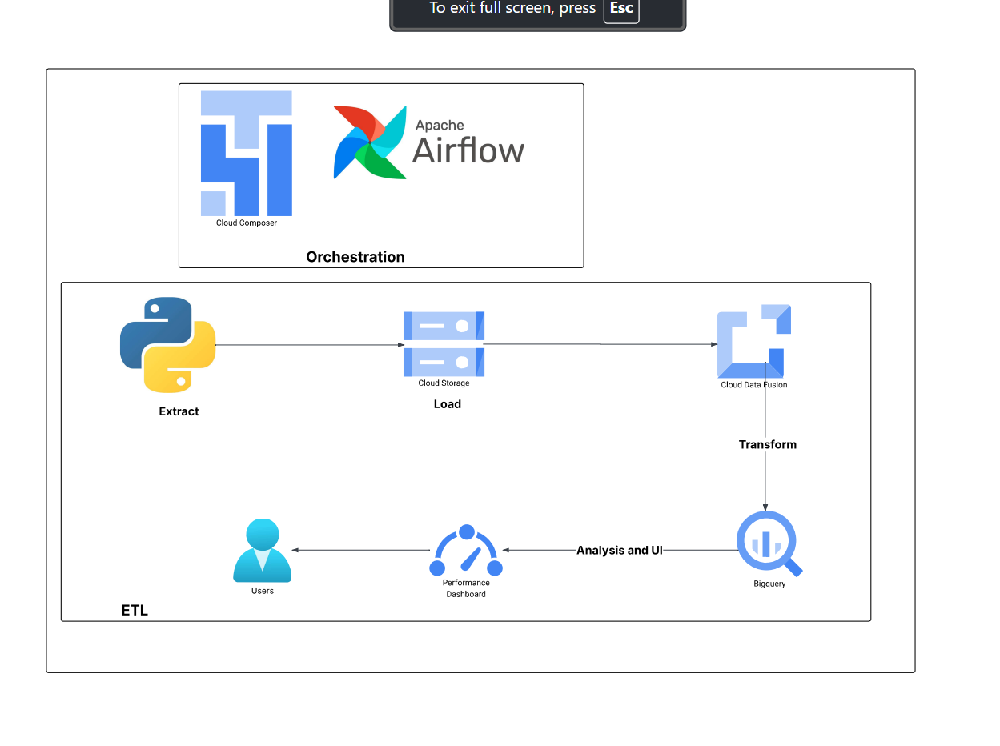

# GCP ETL Pipeline: Faker to BigQuery

This project demonstrates a simple yet complete ETL pipeline on **Google Cloud Platform (GCP)**, combining both code-based and low-code components. It automates the generation, transformation, and loading of synthetic employee data into BigQuery using:

- **Python (Faker)** for synthetic data generation
- **Google Cloud Storage (GCS)** for intermediate storage
- **Cloud Data Fusion** for transformation and load operations
- **Cloud Composer (Apache Airflow)** for orchestration of all steps

---

## Architecture

1. **Data Generation**
   - A Python script generates fake employee records using the `Faker` library.
   - Data is saved as a CSV file and uploaded to GCS.

2. **Data Transformation & Loading**
   - A **Cloud Data Fusion** pipeline reads the uploaded CSV from GCS.
   - Manual transformations are applied (described in [`transformations.md`](datafusion/transformations.md)).
   - The cleaned data is written to a BigQuery table.

3. **Orchestration**
   - **Two Airflow DAGs** are defined:
     - `create_pipeline_dag.py`: (Optional) Creates and manages the Cloud Data Fusion pipeline.
     - `run_pipeline_dag.py`: Executes the complete ETL process daily using Composer.



---

## Repository Structure

```text
gcp-etl-faker-datafusion-bigquery/
├── Architecture.png               ← System architecture diagram
├── extract.py                     ← Python script to generate fake data
├── dags/
│   ├── create_pipeline_dag.py     ← DAG to create the Data Fusion pipeline
│   └── run_pipeline_dag.py        ← DAG to run the ETL pipeline
└── README.md                      ← Project overview       
